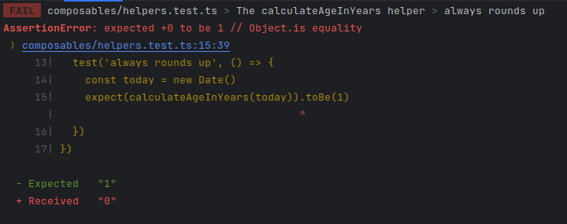
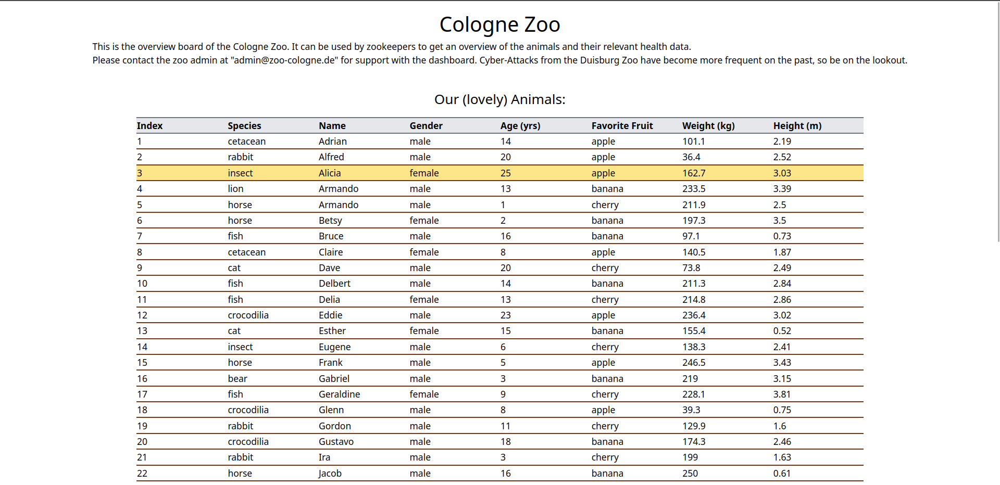
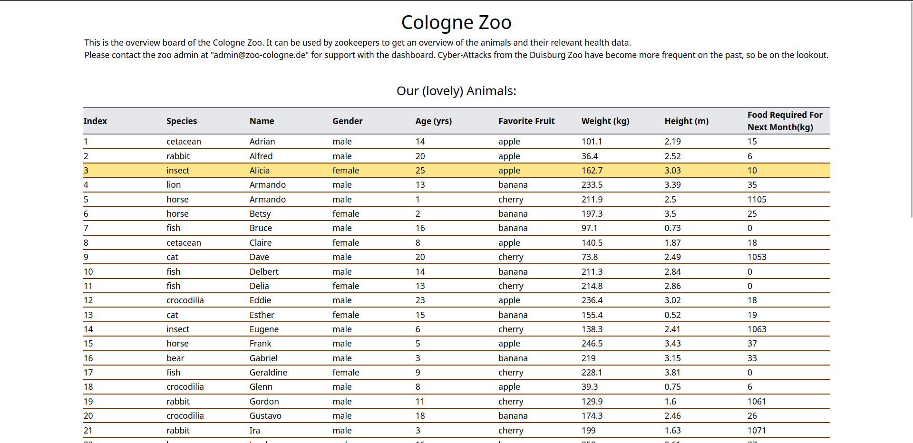

# Challenge

Welcome to the challenge!

Some packages are already being installed for you below - you can just start reading the below text while that finishes.

## The Introduction

The following script takes you through tasks you should complete as part of your challenge. Some tasks may be tricky, some may be easy. In every case you are encouraged to pose written questions to the task itself, write down questions/observations or reasoning about why you did not find a solution. In most cases though, a working solution will be achievable. In all cases it will be helpful if add notes about your methodology (e.g.: "I did X using Y because of Z, then A happened which I fixed doing B. I should have seen A coming but didn't because of C").

There will be no loop with the reviewer, so nobody is going to answer your notes, questions, musings, ... - their main aim is to showcase your thought process for a fellow developer who will inspect this challenge. For the texts you can write everything from a bullet list to a book, but be aware that in development we usually try to optimize for a combination of dense information + understandability by every team member. We firmly believe that good communication and conceptualization is as important to being a developer as the coding itself.

The challenge tries to be similar to the real-world with the kinds of problems and solutions that would occur in every-day-project-work. There will be no questions asking you to optimize runtime-complexity in O-notation to the max for algorithm Y - these sort of questions do not make any sense in our opinion. Being close to the real-world also means that you may bring in CSS/JS Libraries to help you develop, just make sure that everything still runs in stackblitz.

The tool we use here is called `stackblitz`. It functions as a fully integrated development environment (IDE). You can go through the full challenge here. If you want to use your local environment you can also download the project using the small "cloud icon" at the top left corner of the screen, just right of "Project". _In the end, the challenge code must run in here inside `stackblitz`, so `npm run dev` has to work. If this is not the case, we will not be able to review your challenge!_

## Tech-Stack

You can skip this section and revisit it later, as the right information will be shared with you at the right places and everything should "just work" as we inteded it to work. If you still want to learn more right now, read on!

This is a "fullstack" TypeScript project using nuxt3 + vue3. Fullstack TypeScript means that we use one typescript code base for both the backend API + the frontend webapp. We have defined helper commands for development, testing, running the app in production, linting, ... that are runnable via `npm run X` where X is the command, checkout the `package.json` for more.

For styling we use TailwindCSS, so far the zoo has not added a CSS component framework to use pre-made components, maybe you will? For testing we use `vitest`, for linting `eslint`. For building components that are testable, maintainable and embeddable we use `storybook`.

Storybook is a wonderful tool that sadly does not work in stackblitz (as the vue3 dependencies cannot run for some reason). So, we've disabled it but left the stories for you to study.

This information will also be shared with you where needed as part of the challenge, so there is no need to dive into anything at all for now.

## The Challenge

So, without further ado: Welcome, new IT Director of the Cologne Zoo! As you can see, the zoo dashboard was badly damaged by the recent malware attacks from the Duisburg Zoo. The old IT Director quit after that attack as he just could not take it anymore. The staff is looking to you to fix this mess and bring the zoo dashboard back to its former glory! 🐻 🐵 Sadly the IT-Department has been underfunded for years before the attack - so the application is quite dated.

### Task 1: Take stock of the repository

In a first step you should inspect the health of the project and report on everything you notice while doing so. This will help you determine what repairs are necessary in the coming steps.

Please take stock fo the page using developer tools, your instincts, ... and write down below what you find.

### Solution: Task 1

***
Looking at the project and using `npm run dev` I could see that we had a request error in the server file, 
probably under the api folder that informs us that the ANIMALS (surely a function or stuff like that), is not defined.
Going to `/api/animals.get.ts`, I could see that there was just a typing error on the word `AN|I|MALS != AN|l|MALS`.
After that, we saw another minor error saying that `alert` is not defined. When I saw the alert function used inside
of `app.vue`, I knew that the problem was that the alert function cannot be used outside of browser environments, 
also it wasn't really needed there.
***

### Task 2: Get the basics running again

Now that we know that is broken, let's try to get things running again, step by step. First we should aim to just get the project to start. Please fix the problem that stops `npm run dev` from working out. Then:
- document the loaded page with a brief description,
- document the problems that needed to be resolved to make it work (so that we can avoid and quicker fix them in the future!)

Zookeepers reported that the error sometimes changes when reloading the page after the initial start.

### Solution: Task 2
***
In addition to the documentation of the [solution](#solution-task-1) for Task 1, I would add a brief 
description of the page after post-fixing. So, the website itself it's pretty simple. It has a brief description about 
what was going on, explaining the reason why the page wouldn't open was because of malware attacks. 
After the short paragraph, there is a table below with data about different animals with different columns like: index,
species, age, weight, etc.
***

### Task 3: Start the documentation

You got it to work! Nice, now the basic functionality is back for the zookeepers. This would be a great point to start on documenting the project. As you can see there is not even a readme file! The old IT Director seems to have left this project in bad shape. Please add documentation with basics on the project, how to start, stop, test, ... it and whatever else information you deem important.

Add your solution below, either as an inline text or link to new documentation file(s) you've created.

### Solution: Task 3

***
#### _[Just click me](README.md)_
***

### Task 4: Test fixing

There's a failing test that for the age calculation helper. Can you figure out what is broken in the implementation or the test it is and resolve the problem? All zookeepers are really interested in what is going on here.

### Solution: Task 4

***
The problem:



For this task, I ran ```npm run test``` and saw what the underlying problem was. In order to solve it I added two if conditions to check for the edge case, specifically to check if the birthdate is in the future. 

***

### Task 5: UI Fixing and Improvement

The zookeepers report that the table is incomplete and different than usually. More specifically:
- they are missing the `Name` column that used to be in _third_ place,
- the table is sorted by weight, it used to be sorted by name,
- the age of the animals should show the age in years and not the birthdate
    - a helper for this already exists, made by the previous zookeeper

Please fix the two above problems and outline what was necessarry to do so.

### Solution: Task 5

***

- For the column with the `Name` header, I did 3 minor fixes:
    - Added the header line `<th>Name</th>`
    - Added the name property to the `v-for` loop of the array
    - Added the line with the result from the loop `<td>{{ name }}</td>`
- For sorting, I modified the `sort()` function to sort per name, instead of per weight
- In the end, I called the `calculateAgeInYears()` helper function with `birthdate` as an argument for the **`Age`** entry to be displayed correctly.
***

### Task 6: UI Feature 1

The zookeepers want to be able to see all details of an animal. Please create such a view that allows them to do so, outline anything about your process while adding the view below. The zookeepers didn't have time for more information, sorry. They'll surely be glad to criticize the first version intensly though and will want to know why you went for the approach you chose.

***
Here's the final look:


Behind this look, I added the values that were left out of the table into the `v-for` loop and created new headers and 
cells for the new properties. Then, I modified the color palette of the background and the added the hover functionality.I also added borders with 
color, and finally I centered the items.  
***

### Task 7: Logic Feature

The zookeepers want a new feature: Calculate the food required for the next calendar month. Basically, the zookeepers want to ease their job and buy a month worth of food in advance. In order to do so they want you to calculate and display the food all animals need for the next month.

To calculate the food an animal needs in kilograms in 1 day, the zookeepers use the following formula:
1. Take height + weight and divide it by 250
2. If the animal is:
    - older than 20 years, half the required food,
    - younger than 2 years, double the required food
3. Cherrys have less calories, so if the favourite fruit of the animal are cherries, add 28 kg
4. If the animal is male, add 20 %
5. If the animal is a fish: The required food is 0 kg

### Solution: Task 7
***

To solve this task, I created two helper functions [`calculateFoodPerDay() and calculateFoodForNextMonth()`](composables/helpers.ts) and passed all the necessary properties as variables. 

For the function ```calculateFoodPerDay()``` , I just applied the formula using arithmetic calculations and different if statements. As for the function ```calculateFoodForNextMonth()```, I created a new variable to get days in a month and multiplied that with the value which is returned from the previous function. In the end, I rounded that value up and returned it. The value then is added at the main Animals Table as a new entry. 

This is how the table looks after task 7's solution is implemented : 


***

### Task 8: Plan New Feature

After the disastrous specification of the new UI feature in the previous task, the zooplanners now want to sit down with you to plan the next feature better before implementation begins. Together you come up with requirements that you write down from the user-perspective (the zookeepers):
- I want to plan when to feed which animal,
- Per animal I want to be able to plan a day + a fruit that I feed them
- There should be an overview of all upcoming feeding tasks that tells me:
    - the animal name,
    - the food fruit,
    - the required amount of food
- the required amount of food is calculated using the algorithm from the previous task
- Tasks should be grouped by day, so that I have something like a "todo" list for each day
    - so for exmaple a structure like:
        - 24.03.2012
            - Anni, Bananas, 20kg
            - Belfried, Cherries, 10kg
        - 27.03.2012
            - ...
        - ...

Please create a breakdown for this feature. You can focus on aspects like: What tasks do we need to cover, what should their order be, how will the UI/UX be designed, what questions arise from the potentially inconsistent or incomplete staff requirements?

Don't spend more thatn 15-30 minutes here - planning like this can quickly become quite complex and we want to prevent this challenge taking too much of your time!

### Solution: Task 8
***
Feature: Animal Feeding Planner

Requirements Breakdown:

1. Task Planning:
    - Allow zookeepers to schedule feeding tasks for each animal.
    - Zookeepers should be able to specify the date and time for each feeding task.
    - Zookeepers should be able to select the animal for which they are scheduling the feeding task.
    - Zookeepers should be able to select the type of fruit to be fed to the animal.

2. Overview of Upcoming Feeding Tasks:
    - The overview should include the following information for each task:
        - Animal name
        - Food fruit
        - Required amount of food
    - The required amount of food should be calculated using the algorithm from the previous task.

3. Grouping of Tasks by Day:
    - The feeding tasks should be grouped by day to provide a clear "todo" list for each day.
    - Each day should display the date.
    - Under each day, the feeding tasks for that day should be listed.

UI/UX Design Considerations:

1. Task Planning Interface:
    - Design a user-friendly interface that allows zookeepers to easily schedule feeding tasks.
    - Include date and time picker controls to specify the date and time for each feeding task.
    - Provide a dropdown or search functionality to select the animal for each feeding task.
    - Include a dropdown or input field to select the type of fruit to be fed to the animal.

2. Overview of Upcoming Feeding Tasks:
    - Design a clear and concise overview section to display the upcoming feeding tasks.
    - Use a table or list format to present the task information, including the animal name, food fruit, and required 
      amount of food.
    - Ensure that the required amount of food is calculated accurately using the algorithm from the previous task.

3. Grouping of Tasks by Day:
    - Structure the feeding tasks in a hierarchical format, grouped by day.
    - Display the date prominently for each day to provide a clear distinction.
    - Use indentation or subheadings to visually separate the feeding tasks under each day.

Questions and Considerations:

- Are there any missing details or inconsistencies in the provided requirements?
- Are there any specific requirements regarding user roles, access permissions, or authentication?
- How should the system handle errors or invalid inputs during the task planning process?
- What validation rules should be implemented for date and time inputs, animal selection, and fruit selection?
- How will the feeding tasks and related data be stored and managed in the system?
- Should there be a database or backend system to store the planned tasks?
- Should the system provide notifications or reminders for upcoming feeding tasks?
- Should the feeding planner be accessible and optimized for mobile devices, considering that zookeepers may use it on the go?

***


### Task 9: Finish the documentation

Revisit docs from step 3, see if you want to add anything. Also think about bonuses. Add a general comment about anything (inside the universe of the challenge or out of it) if you want to.

***
_[Just click me](README.md)_
***
